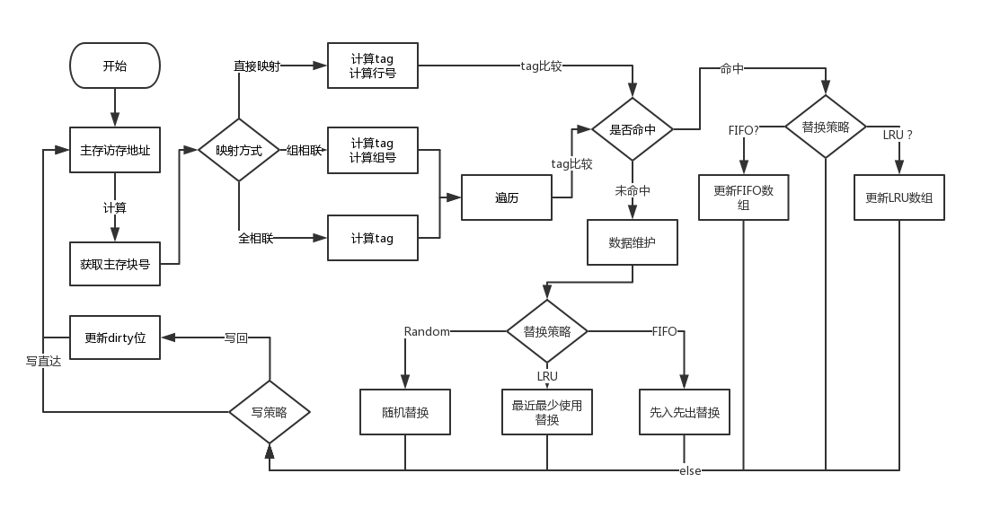

# Cache模拟器

## 使用说明
* 编译main.cpp
    > gcc main.cpp -o main

* 生成结果
    > ./main tracefile > result.txt

* 预览效果
    ```
    |L1 1KB|8B|直接映射|NONE|写直达法|
    i-cache访存总次数：1300378105
    命中率：91.5113 %
    d-cache访存总次数：691011567
    读次数：621498605|写次数：69512962
    命中率：79.476 %
    读命中率：82.2414 %|写命中率：54.7517 %
    ```
## 流程图


## 实现功能
* 分别记录i-cache和d-cache
* 统计访存次数
* 计算命中率

### 映射方式
* 直接映射
* 全相联映射
* 组相联映射

### 替换方式
* 直接替换
* Random——时间作为随机数种子
* LRU——优先级数组
* FIFO——记录进入顺序数组
* LFU未实现（与LRU类似）

### 写方式
* 写直达
* 写回——dirty位
